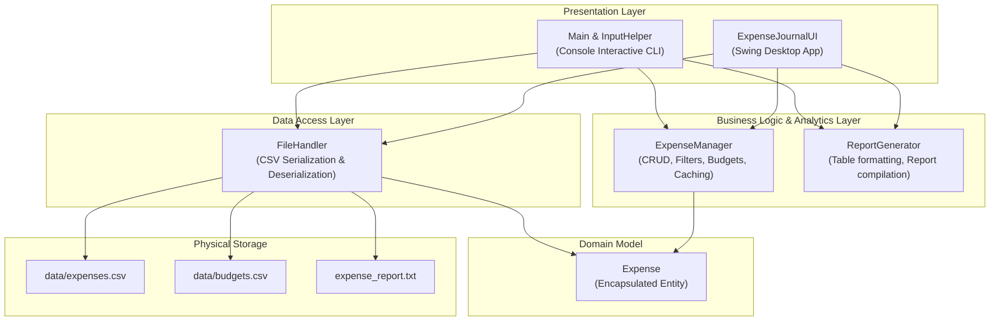

# Smart Expense Journal

[](https://www.oracle.com/java/)
[](https://github.com/)
[](https://github.com/)
[](https://github.com/)

A lightweight, robust Core Java personal finance application featuring both a modern **Desktop Swing GUI** and an interactive **Terminal Console CLI**. Designed with clean object-oriented principles, resilient CSV data persistence, and financial precision using `BigDecimal`.

---

## Table of Contents

- [Overview](#overview)
- [Key Features](#key-features)
- [System Architecture](#system-architecture)
- [Project Structure](#project-structure)
- [Prerequisites & Requirements](#prerequisites--requirements)
- [How to Run](#how-to-run)
  - [1-Click Launch (Windows)](#1-1-click-launch-windows)
  - [Desktop GUI Mode (Standard)](#2-desktop-gui-mode-standard)
  - [Console CLI Mode](#3-console-cli-mode)
  - [Automated Verification / Headless Check](#4-automated-verification--headless-check)
  - [Running in VS Code or IntelliJ IDEA](#5-running-in-vs-code-or-intellij-idea)
- [Application Walkthrough](#application-walkthrough)
  - [Desktop UI Overview](#desktop-ui-overview)
  - [Console CLI Walkthrough](#console-cli-walkthrough)
- [Data Storage & Persistence](#data-storage--persistence)
- [Technical Highlights & Engineering Decisions](#technical-highlights--engineering-decisions)
- [Future Roadmap](#future-roadmap)

---

## Overview

Managing personal expenses should be fast, private, and dependable. **Smart Expense Journal** provides an intuitive dual-mode expense management system written in pure Core Java without requiring bulky frameworks, databases, or third-party dependencies.

Whether running via the desktop interface or within a lightweight terminal session, user data is immediately persisted in structured CSV files, validated against malformed input, and safeguarded with budget warnings and exportable analytical summaries.

---

## Key Features

### 1. Expense Management (CRUD)
- **Add Expense**: Log date (`yyyy-MM-dd`), category, amount, and optional descriptive notes. Defaults to current date if left blank.
- **View All**: Tabular display showing ID, Date, Category, Amount (formatted in standard currency), and Note.
- **Edit Expense**: Modify any field of an existing expense by selecting it in the UI or entering its ID in the CLI.
- **Delete with Confirmation**: Remove records safely with an explicit confirmation step to prevent accidental loss.

### 2. Search & Multi-Criteria Filtering
- **Keyword Search**: Instant search across expense note descriptions (case-insensitive substring match).
- **Category Filter**: Filter expenses by category (e.g., Food, Travel, Utilities, Entertainment).
- **Date Filtering**: Drill down into specific spending by month and year.

### 3. Financial Analytics & Summaries
- **Total Spending Calculation**: Running sum computed with `BigDecimal` financial precision.
- **Category-Wise Breakdown**: Aggregated totals per category sorted alphabetically using `TreeMap`.
- **Monthly Spending Trends**: Chronological totals grouped by year and month.
- **Highest Expense Tracker**: Instantly identify the single largest expense logged.
- **Recent Transactions**: Quick view of the latest 5 transactions.

### 4. Monthly Budgeting & Overspending Alerts
- Set target monthly budgets for any Year-Month combination.
- Real-time comparison of actual expenditure versus set budget.
- Automatic alert warnings when spending crosses the defined limit.

### 5. Report Generation & Export
- One-click / one-command text report generator.
- Exports a cleanly formatted summary with statistics and tables to `expense_report.txt`.

### 6. Fault-Tolerant Persistence
- Auto-initializes `data/expenses.csv` and `data/budgets.csv` on first run.
- Full RFC 4180-compliant CSV handling (supports quotes, escaped quotes, and commas inside notes).
- Graceful recovery: skips corrupt lines with clear warnings rather than crashing.

---

## System Architecture

The application adheres to clean separation of concerns:



- **Model Layer (`Expense`)**: Clean POJO representing an individual expense entity with private fields, validation, and defensive string sanitization.
- **Service Layer (`ExpenseManager`)**: Encapsulates all business rules, indexing, category/month aggregation, and sort-cache invalidation.
- **Persistence Layer (`FileHandler`)**: Manages I/O operations using Java NIO (`Files`, `Paths`), custom CSV quotation tokenizer, and automatic folder creation.
- **UI / Presentation (`ExpenseJournalUI` & `Main`)**: Desktop Swing interface with custom styling and a robust terminal menu loop with input sanitization.
- **Reporting (`ReportGenerator`)**: Formats aligned tables and analytical exports.

---

## Project Structure

```text
SMART EXPENSE JOURNAL/
├── src/                      # Java source code
│   ├── Expense.java          # Model class: ID, Date, Category, Amount, Note
│   ├── ExpenseJournalUI.java # Desktop GUI: Modern Swing window, table, cards & filters
│   ├── ExpenseManager.java   # Core engine: CRUD logic, HashMap index, summaries, budgets
│   ├── FileHandler.java      # Persistence: CSV reader/writer with quotation support
│   ├── InputHelper.java      # CLI validation: Safe input reading, range checks, EOF handling
│   ├── Main.java             # Entry point: Dispatches GUI or Console CLI mode
│   └── ReportGenerator.java  # Reporting: ASCII tables, summary formatting, export generator
├── data/                     # Persisted data storage
│   ├── expenses.csv          # Persisted expense records (CSV format)
│   └── budgets.csv           # Persisted monthly budgets (CSV format)
├── RUN_APP.bat               # Windows batch script for 1-click compile & launch
├── README.md                 # Project documentation and setup guide
├── .gitignore                # Git ignore rules (build artifacts, IDE files)
└── expense_report.txt        # Generated report output file
```

---

## Prerequisites & Requirements

- **Java Development Kit (JDK)**: Version 8, 11, 17, 21, or higher.
- **Operating System**: Windows, macOS, or Linux.
- **Terminal / Shell**: PowerShell, Command Prompt, Bash, or Zsh.

Verify your Java installation:

```bash
java -version
javac -version
```

---

## How to Run

### 1. 1-Click Launch (Windows)
Double-click `RUN_APP.bat` in the project root folder. It automatically compiles the classes and launches the desktop application.

### 2. Desktop GUI Mode (Standard)
Open a terminal in the project directory and execute:

```bash
javac src/*.java
java -cp src Main
```

This starts the Swing desktop application in the Event Dispatch Thread.

### 3. Console CLI Mode
To run the interactive terminal interface without GUI windows:

```bash
java -cp src Main console
```

### 4. Automated Verification / Headless Check
To verify that UI classes initialize and instantiate cleanly without starting a persistent window:

```bash
java -cp src Main --ui-check
```
*Expected Output:* `UI check passed.`

### 5. Running in VS Code or IntelliJ IDEA
- **VS Code**:
  1. Open the project root folder in VS Code (`File` -> `Open Folder...`).
  2. Install the *Extension Pack for Java* (if not already installed).
  3. Open [Main.java](file:///c:/Users/Jainik/Desktop/java%20proj/SMART%20EXPENSE%20JOURNAL/src/Main.java) and click **Run**.
- **IntelliJ IDEA**:
  1. Open folder as a project.
  2. Mark `src` as *Sources Root* (right click `src` -> `Mark Directory as` -> `Sources Root`).
  3. Run `Main.main()`.

---

## Application Walkthrough

### Desktop UI Overview

The desktop GUI is organized into three balanced columns:

```text
+----------------------------------------------------------------------------------------------------+
|  [ HEADER ]  Smart Expense Journal                      [ Reload ]  [ Save ]                       |
+----------------------+---------------------------------------------------+-------------------------+
|  [ LEFT: FORM ]      |  [ CENTER: TABLE & FILTERS ]                      |  [ RIGHT: SNAPSHOT ]    |
|                      |  Note: [____]  Category: [____]  [Month] [Year]   |  Total: INR 1,450.00    |
|  Date: [2026-10-02]  |  +----+------------+----------+------------+----+ |  Records: 2             |
|  Category: [Food]    |  | ID | Date       | Category | Amount     | ...| |  Highest: INR 900.00   |
|  Amount: [250.00]    |  +----+------------+----------+------------+----+ |  ---------------------- |
|  Note: [Lunch]       |  |  1 | 2026-10-02 | Food     | INR 250.00 | ...| |  Category Summary       |
|                      |  |  2 | 2026-10-02 | Travel   | INR 900.00 | ...| |  Monthly Summary        |
|  [ Add ]             |  +----+------------+----------+------------+----+ |  ---------------------- |
|  [ Edit Selected ]   |  [ Delete Selected ]  [ Recent 5 ]  [ Export ]    |  Set Budget for Month   |
|  [ Clear ]           |                                                   |  [ Set Budget ]         |
+----------------------+---------------------------------------------------+-------------------------+
|  [ FOOTER / STATUS ] Ready                                                                         |
+----------------------------------------------------------------------------------------------------+
```

- **Left Panel (Form)**: Fast expense entry. Selecting any row in the table automatically populates this form for rapid edits.
- **Center Panel (Data Table & Search Bar)**: Interactive table with real-time column widths, category search, text search, and month/year filters.
- **Right Panel (Analytics & Budgeting)**: Live metric cards displaying total spending, transaction count, highest expense, and a dedicated monthly budget setter with instant budget tracking.
- **Header Actions**: Quick access to reload data or manually trigger file synchronization.

### Console CLI Walkthrough

The CLI provides a formatted menu with clear prompts and input validation:

```text
==============================================================================
                            SMART EXPENSE JOURNAL
                      Core Java Console Expense Tracker
==============================================================================
Total Expenses: 2      Total Spending: INR 1350.00
Budget October 2026: INR 1350.00 / INR 5000.00
------------------------------------------------------------------------------
 1. Add Expense
 2. View All Expenses
 3. Edit Expense
 4. Delete Expense
 5. Search Notes
 6. Filter By Category
 7. Filter By Month And Year
 8. View Spending Summary
 9. Recent 5 Expenses
10. Set Monthly Budget
11. Export Text Report
12. Save And Exit
------------------------------------------------------------------------------
Choose option:
```

All table outputs are neatly aligned:

```text
-----------------------------------------------------------------------------------------------
ID    Date         Category                Amount  Note                                    
-----------------------------------------------------------------------------------------------
1     2026-10-02   Books               INR 450.00  Java Programming Guide                  
2     2026-10-02   Travel              INR 900.00  Monthly Train Pass                      
-----------------------------------------------------------------------------------------------
Rows: 2
```

---

## Data Storage & Persistence

Data is stored as standard comma-separated values (CSV) under the `data/` directory:

### 1. `data/expenses.csv`
```csv
id,date,category,amount,note
1,2026-10-02,Books,450.00,Java Programming Guide
2,2026-10-02,Food,120.00,"Coffee, Snacks & Water"
```

### 2. `data/budgets.csv`
```csv
month,amount
2026-10,5000.00
```

### Safety Features
- **Quotation Escaping**: Values containing commas, double quotes, or line breaks are automatically wrapped in quotes and internal quotes are doubled (`""`).
- **Resilient Parsing**: Corrupted or empty lines are safely ignored with a console warning, preventing application crashes or data wipeout.
- **Immediate Write-Through**: Every modification (add, edit, delete, budget update) persists automatically to disk.

---

## Technical Highlights & Engineering Decisions

| Requirement | Implementation | Rationale |
|---|---|---|
| **Currency Calculations** | `java.math.BigDecimal` | `double` and `float` suffer from binary floating-point representation errors (e.g. `0.1 + 0.2 != 0.3`). `BigDecimal` provides exact decimal arithmetic essential for financial software. |
| **Fast ID Lookups** | `HashMap<Integer, Expense>` | Enables $O(1)$ constant-time lookup by ID during edit, delete, and selection operations. |
| **Ordered Listings** | `ArrayList<Expense>` | Ideal for indexed table display, sorting, and fast linear iteration. |
| **Sorted Summaries** | `TreeMap<String, BigDecimal>` | Automatically maintains natural alphabetical order for category breakdowns and chronological order for month summaries. |
| **Performance Optimization** | Dirty flag caching (`sortedCacheDirty`) | Sorting all expenses on every query is wasteful. The sort order is cached and re-computed only when items are added, edited, or deleted. |
| **UI Responsiveness** | Event Dispatch Thread (`SwingUtilities.invokeLater`) | Ensures Swing components are constructed and mutated strictly on the UI thread, preventing GUI deadlocks and race conditions. |
| **Encapsulation & Immutability** | Defensive copies & `unmodifiableList` | `getAllExpenses()` and getters return safe copies or unmodifiable collections to prevent external mutation of internal data structures. |

---

## Future Roadmap

- [ ] **Data Visualization**: Integrate visual bar and pie charts for category breakdowns using Java2D.
- [ ] **Database Backend**: Add an optional SQLite / JDBC persistence layer alongside CSV.
- [ ] **Export Formats**: Add PDF and Excel (.xlsx) export capabilities.
- [ ] **Recurring Expenses**: Support automatic recurring monthly bills and subscriptions.
- [ ] **Tags & Multi-Currency**: Add custom tag filtering and real-time currency conversion rates.

---

## Author & License

Developed with Core Java. Open-source under the [MIT License](https://opensource.org/licenses/MIT).
